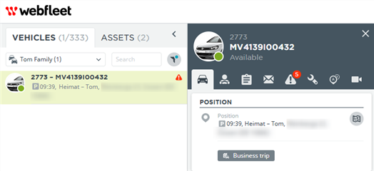

# WEBFLEET integration
Import your vehicle from [WEBFLEET](https://live.webfleet.com/web/index.html):

To homeassistant and create your custom automations and insights based on new device tracker entities:

# Configuration

As there is no UI config flow yet you need to add the following lines to your configuration.
Make sure to add your secrets and account credentials accordingly. 
It is recommended to make use of an API key to configure scope and flood protection measures.

    device_tracker:
      - platform: webfleet
        url: !secret webfleet_url
        at: !secret webfleet_account
        username: !secret webfleet_username
        password: !secret webfleet_pwd
        devices: !secret webfleet_group
        api_key: !secret webfleet_apikey

#### Minimum Example of your configuration.yaml
    device_tracker:
    - platform: webfleet
      username: _your_username_
      at: _your_webfleet_account_name_
      password: _your_password_

## Useful links

- [WEBFLEET Developer Resources](https://www.webfleet.com/en_gb/webfleet/partners/integration/developer-resources/)

## How to install without [HACS](https://hacs.xyz/)

Copy the files to your `config` directy of homeassistant underneath `custom_components`.

e.g. `config/custom_components/webfleet/__init__.py`

## Work in progress

Currently a lot of values are hard-coded and not ready for more. 
Contributions appreciated.
